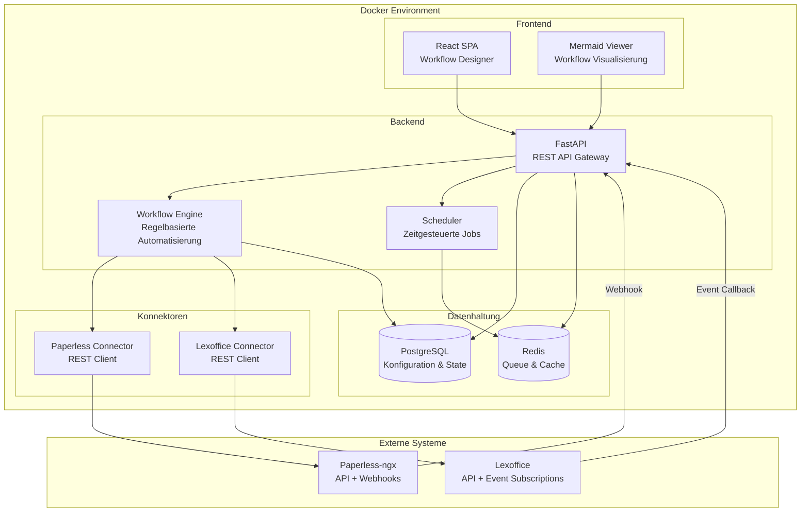
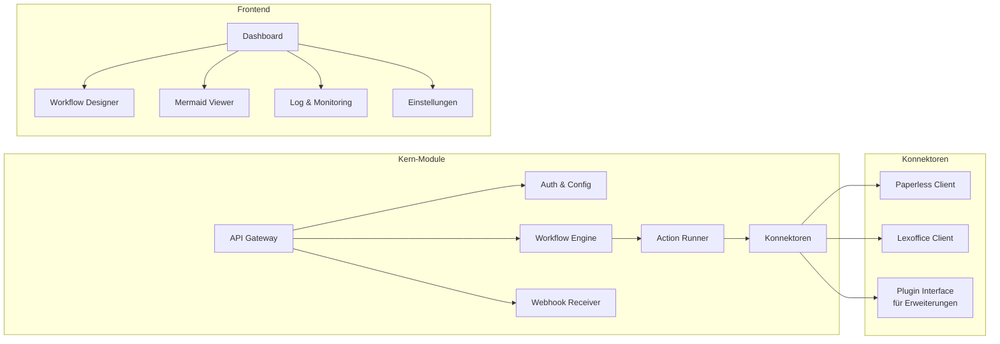
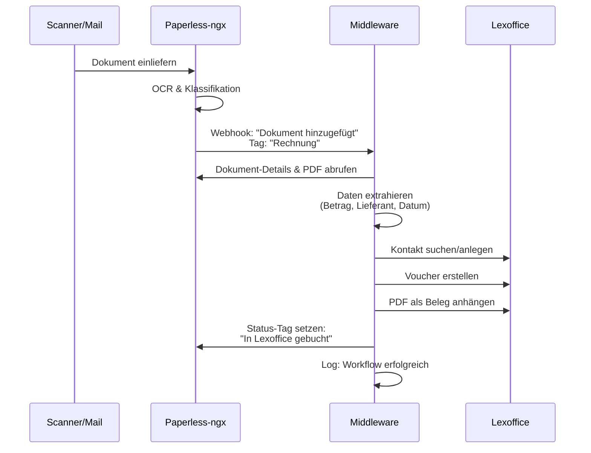
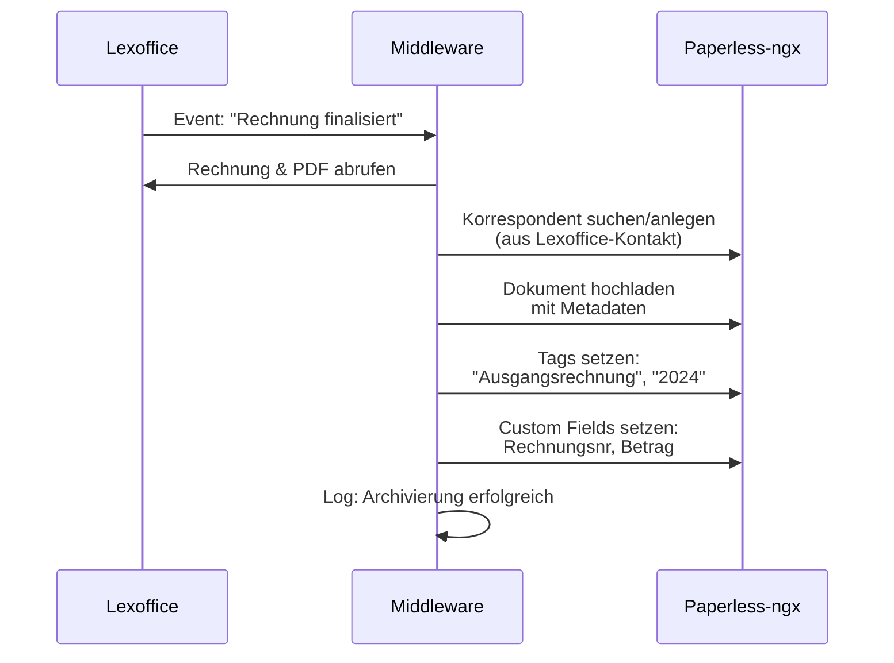
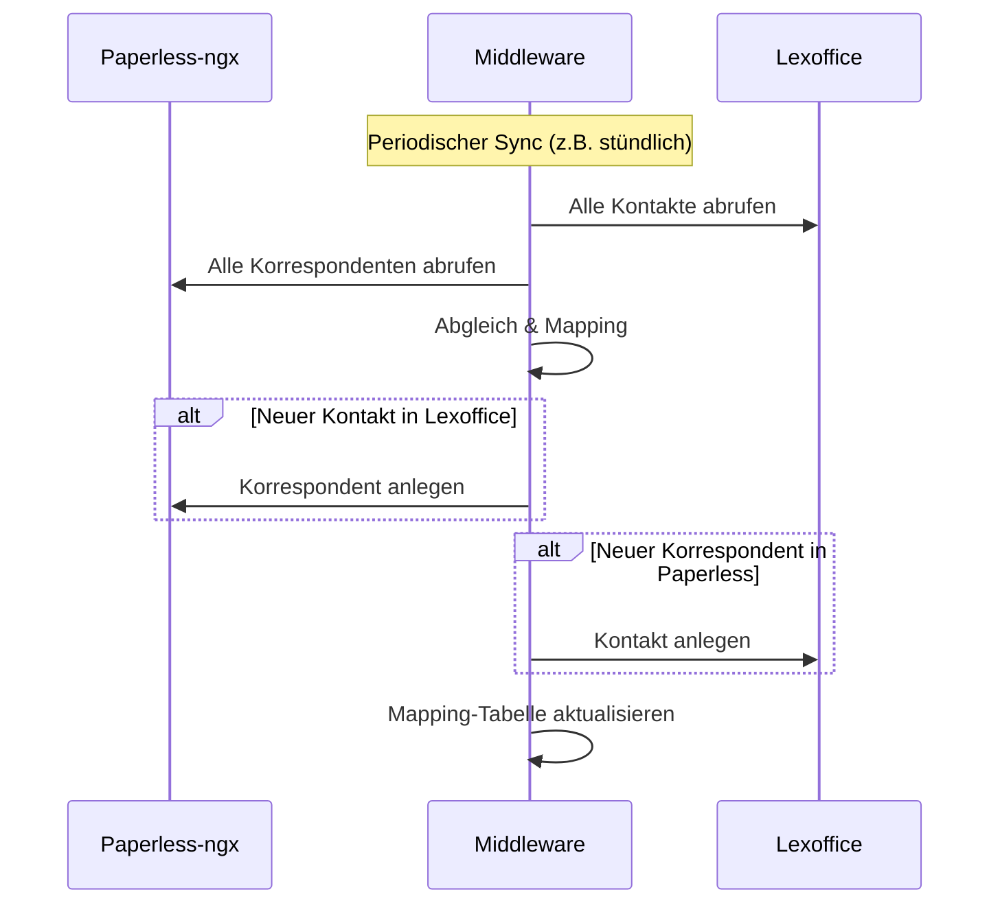
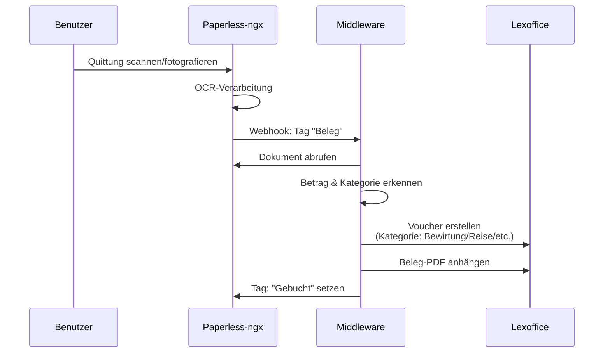
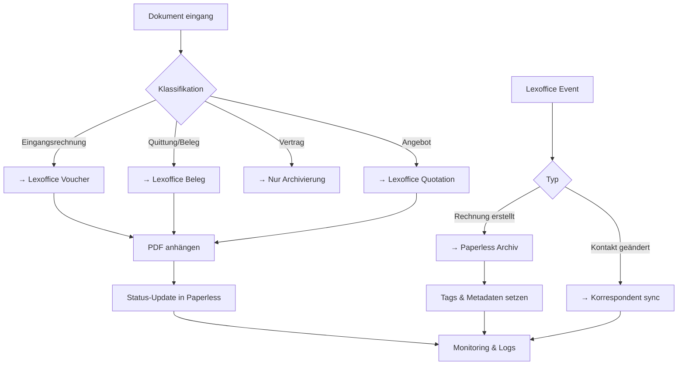
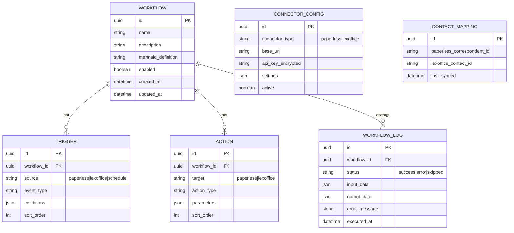

# Paperless-Lexoffice Middleware – Architekturplan

> **Motto:** Einmal planen, einmal bauen, einmal fertig.

## 1. Vision

Eine Docker-basierte Middleware, die **Paperless-ngx** (Dokumentenmanagement) mit **Lexoffice/Lexware Office** (Buchhaltung) verbindet. Über eine grafische Oberfläche können Benutzer Workflows definieren, die Dokumente automatisch zwischen beiden Systemen synchronisieren.

**Kommerzielle Eignung:** Modularer Aufbau mit austauschbaren Konnektoren – weitere Systeme (DATEV, sevDesk, etc.) können als Plugins hinzugefügt werden.

---

## 2. Systemarchitektur



---

## 3. Komponentenübersicht



---

## 4. Workflow-Ideen

### 4.1 Eingangsrechnung: Paperless → Lexoffice



### 4.2 Ausgangsrechnung: Lexoffice → Paperless



### 4.3 Kontakt-Synchronisation



### 4.4 Belegerfassung: Quittungen & Belege



### 4.5 Dokumenten-Lifecycle (Gesamtübersicht)



---

## 5. Datenmodell



---

## 6. Tech-Stack

| Komponente | Technologie | Begründung |
|---|---|---|
| **Backend** | Python 3.12 + FastAPI | Async-fähig, gut dokumentiert, Industrie-Standard |
| **Frontend** | React 18 + TypeScript + Vite | Schnell, typsicher, großes Ökosystem |
| **Workflow-Visualisierung** | Mermaid.js | Deklarativ, vielseitig, in Frontend integrierbar |
| **Datenbank** | PostgreSQL 16 | Robust, JSON-Support, produktionsreif |
| **Queue/Cache** | Redis 7 | Job-Queue für async Workflows, Caching |
| **Task Queue** | Celery / ARQ | Hintergrund-Verarbeitung der Workflows |
| **ORM** | SQLAlchemy 2.0 + Alembic | Migration-Support, async-kompatibel |
| **Container** | Docker + Docker Compose | Einfache Installation, reproduzierbar |
| **API Docs** | Swagger/OpenAPI (auto) | FastAPI generiert automatisch |

---

## 7. Projektstruktur

```
paperless-lexoffice-middleware/
├── docker-compose.yml
├── .env.example
├── README.md
├── PLAN.md
│
├── backend/
│   ├── Dockerfile
│   ├── pyproject.toml
│   ├── alembic.ini
│   ├── alembic/
│   │   └── versions/
│   ├── app/
│   │   ├── __init__.py
│   │   ├── main.py                    # FastAPI App
│   │   ├── config.py                  # Settings
│   │   ├── database.py                # DB Connection
│   │   │
│   │   ├── api/                       # REST Endpoints
│   │   │   ├── __init__.py
│   │   │   ├── workflows.py
│   │   │   ├── connectors.py
│   │   │   ├── webhooks.py
│   │   │   ├── mappings.py
│   │   │   └── logs.py
│   │   │
│   │   ├── connectors/                # API-Clients
│   │   │   ├── __init__.py
│   │   │   ├── base.py                # Abstract Connector
│   │   │   ├── paperless.py           # Paperless Client
│   │   │   └── lexoffice.py           # Lexoffice Client
│   │   │
│   │   ├── engine/                    # Workflow Engine
│   │   │   ├── __init__.py
│   │   │   ├── executor.py            # Workflow Runner
│   │   │   ├── triggers.py            # Trigger Handler
│   │   │   ├── actions.py             # Action Handler
│   │   │   └── scheduler.py           # Cron/Schedule
│   │   │
│   │   ├── models/                    # SQLAlchemy Models
│   │   │   ├── __init__.py
│   │   │   ├── workflow.py
│   │   │   ├── connector.py
│   │   │   ├── mapping.py
│   │   │   └── log.py
│   │   │
│   │   └── schemas/                   # Pydantic Schemas
│   │       ├── __init__.py
│   │       ├── workflow.py
│   │       ├── connector.py
│   │       └── common.py
│   │
│   └── tests/
│       ├── __init__.py
│       ├── test_connectors.py
│       └── test_workflows.py
│
├── frontend/
│   ├── Dockerfile
│   ├── package.json
│   ├── tsconfig.json
│   ├── vite.config.ts
│   ├── index.html
│   ├── public/
│   └── src/
│       ├── main.tsx
│       ├── App.tsx
│       ├── api/                       # API Client
│       │   └── client.ts
│       ├── components/
│       │   ├── Layout.tsx
│       │   ├── MermaidViewer.tsx       # Mermaid Renderer
│       │   ├── WorkflowDesigner.tsx
│       │   └── WorkflowCard.tsx
│       ├── pages/
│       │   ├── Dashboard.tsx
│       │   ├── Workflows.tsx
│       │   ├── Connections.tsx
│       │   └── Logs.tsx
│       └── styles/
│           └── globals.css
│
└── nginx/
    └── nginx.conf
```

---

## 8. API-Endpunkte (Middleware)

| Methode | Pfad | Beschreibung |
|---|---|---|
| `GET` | `/api/health` | Health Check |
| `GET/POST` | `/api/connectors` | Konnektoren verwalten |
| `POST` | `/api/connectors/{id}/test` | Verbindung testen |
| `GET/POST` | `/api/workflows` | Workflows CRUD |
| `PUT/DELETE` | `/api/workflows/{id}` | Workflow bearbeiten/löschen |
| `POST` | `/api/workflows/{id}/execute` | Workflow manuell ausführen |
| `GET` | `/api/workflows/{id}/mermaid` | Mermaid-Diagramm generieren |
| `POST` | `/api/webhooks/paperless` | Paperless Webhook Empfänger |
| `POST` | `/api/webhooks/lexoffice` | Lexoffice Event Empfänger |
| `GET` | `/api/mappings/contacts` | Kontakt-Mappings |
| `GET` | `/api/logs` | Workflow-Logs |
| `GET` | `/api/dashboard/stats` | Dashboard Statistiken |

---

## 9. Sicherheitskonzept

- **API-Keys** werden verschlüsselt in der DB gespeichert (Fernet)
- **Webhook-Validierung** via HMAC-Signatur (Lexoffice) / Secret Token (Paperless)
- **Rate Limiting** auf allen Endpunkten (Lexoffice erlaubt max. 2 req/s)
- **CORS** konfigurierbar für Frontend-Origin
- **Environment Variables** für sensible Konfiguration
- **Kein Default-Admin-Passwort** – wird beim Setup gesetzt

---

## 10. Umsetzungsplan

| Phase | Beschreibung | Dateien |
|---|---|---|
| **Phase 1** | Projekt-Setup, Docker, DB | docker-compose.yml, Dockerfiles, Models |
| **Phase 2** | Konnektoren (Paperless + Lexoffice) | connectors/*.py |
| **Phase 3** | Workflow Engine | engine/*.py |
| **Phase 4** | REST API | api/*.py |
| **Phase 5** | Frontend mit Mermaid | frontend/src/**/* |
| **Phase 6** | Integration & Tests | tests/, docker-compose |

---

## 11. Workflow-Typen (Vorkonfiguriert)

1. **Eingangsrechnung archivieren** – Paperless → Lexoffice Voucher
2. **Ausgangsrechnung archivieren** – Lexoffice → Paperless Archiv
3. **Kontakte synchronisieren** – Bidirektionaler Sync
4. **Belege erfassen** – Paperless → Lexoffice Beleg
5. **Angebote verfolgen** – Lexoffice Quotation → Paperless
6. **Mahnungen archivieren** – Lexoffice Dunning → Paperless
